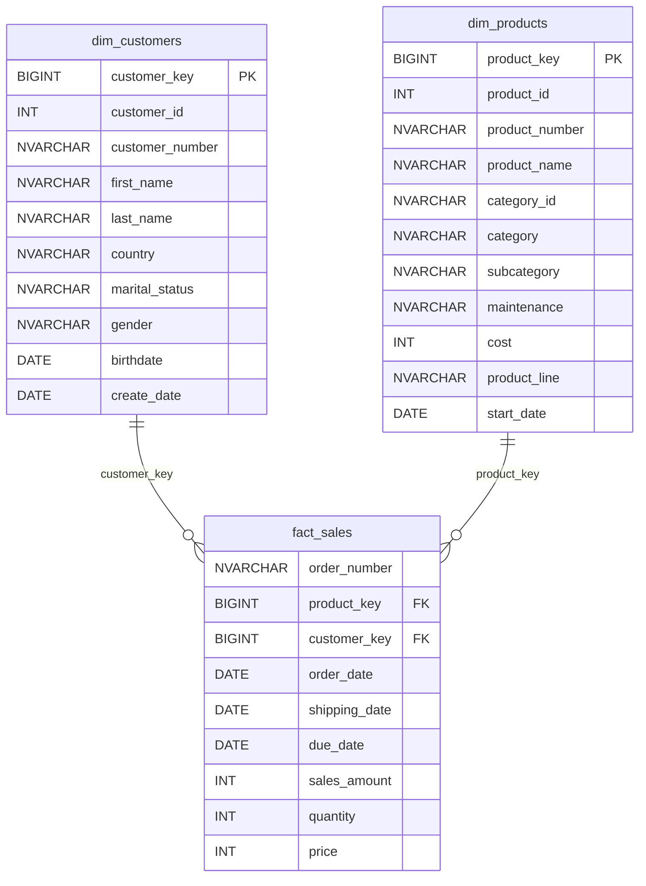

# Modelo de datos – Esquema en estrella

```mermaid
erDiagram
    dim_customers ||--o{ fact_sales : "customer_key"
    dim_products  ||--o{ fact_sales : "product_key"

    dim_customers {
        BIGINT customer_key PK
        INT customer_id
        NVARCHAR customer_number
        NVARCHAR first_name
        NVARCHAR last_name
        NVARCHAR country
        NVARCHAR marital_status
        NVARCHAR gender
        DATE birthdate
        DATE create_date
    }

    fact_sales {
        NVARCHAR order_number
        BIGINT product_key FK
        BIGINT customer_key FK
        DATE order_date
        DATE shipping_date
        DATE due_date
        INT sales_amount
        INT quantity
        INT price
    }

    dim_products {
        BIGINT product_key PK
        INT product_id
        NVARCHAR product_number
        NVARCHAR product_name
        NVARCHAR category_id
        NVARCHAR category
        NVARCHAR subcategory
        NVARCHAR maintenance
        INT cost
        NVARCHAR product_line
        DATE start_date
    }
```

**Regla de negocio:** `sales_amount = quantity × price`
